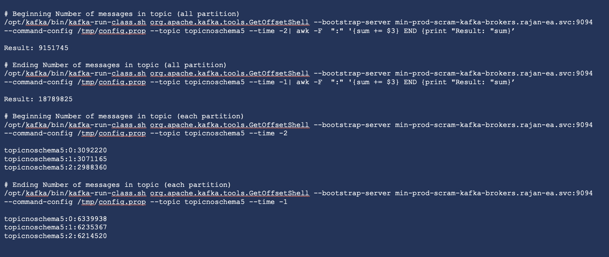

# count-messages-kafka
This is a guide to get the number of messages in a Kafka topic / partition.    
There is a tool
This kafka-run-class tool is a thin wrapper around the Kafka Java class. It is called by other tools, and normally not run or modified directly.  However, if you are proficient with bash and want to understand certain features available in all Kafka scripts as well as some potential debugging scenarios, familiarity with the kafka-run-class script can prove highly beneficial.   

The focus will in using the tool in Event Streams. It can be generally used in any Kafka systems. 

### Steps to get this.   

1. Log into one of the Kafka pods. 
2. Create a prpperties file /tmp/ folder in the pod. The contents of the file should be something like this. This is a standard Kafka properties file.    

        ssl.truststore.type=PKCS12
        ssl.truststore.location=/opt/kafka/cluster-ca-certs/ca.p12
        ssl.truststore.password=TRUSTSTORE-PASSWORD
        sasl.mechanism=SCRAM-SHA-512
        security.protocol=SASL_SSL
        sasl.jaas.config=org.apache.kafka.common.security.scram.ScramLoginModule required username='SCRAM-USER' password='SCRAM PASSWORD';

        
3. Run this command to get information of the offsets.  

        To get the earliest offset available:   

        /opt/kafka/bin/kafka-run-class.sh org.apache.kafka.tools.GetOffsetShell \  
          --bootstrap-server min-prod-scram-kafka-brokers.rajan-ea.svc:9094 \
          --command-config /tmp/config.prop \
          --topic topicnoschema5 \
          --time -2   

        To get the last offset available:   
        
        /opt/kafka/bin/kafka-run-class.sh org.apache.kafka.tools.GetOffsetShell \  
          --bootstrap-server min-prod-scram-kafka-brokers.rajan-ea.svc:9094 \
          --command-config /tmp/config.prop \
          --topic topicnoschema5 \
          --time -1   

    The above will give the respective offset values for each partition in the topic. To get the number for the entire topic, add this to the end of the command.  

        | awk -F  ":" '{sum += $3} END {print "Result: "sum}'
        
4. Sample output.   

  

        Based on this capture, number of messages still in topic:
        18789825 - 9151745 = 9638080

